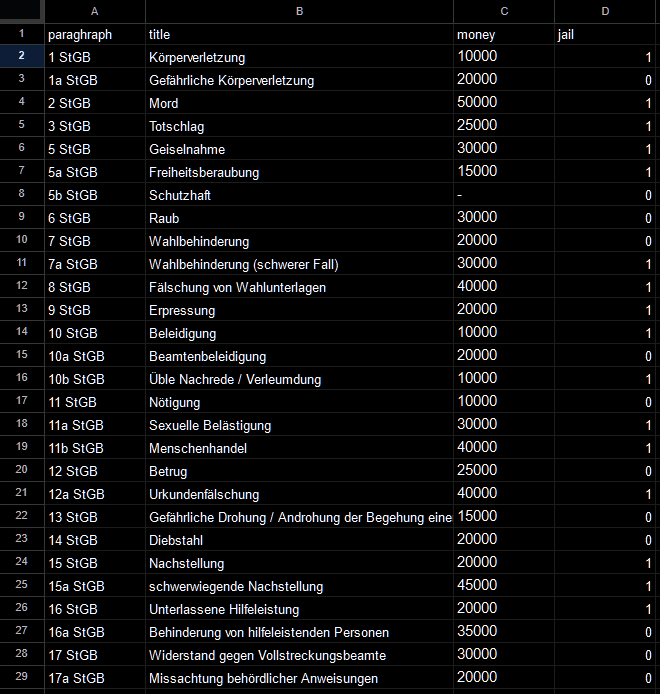
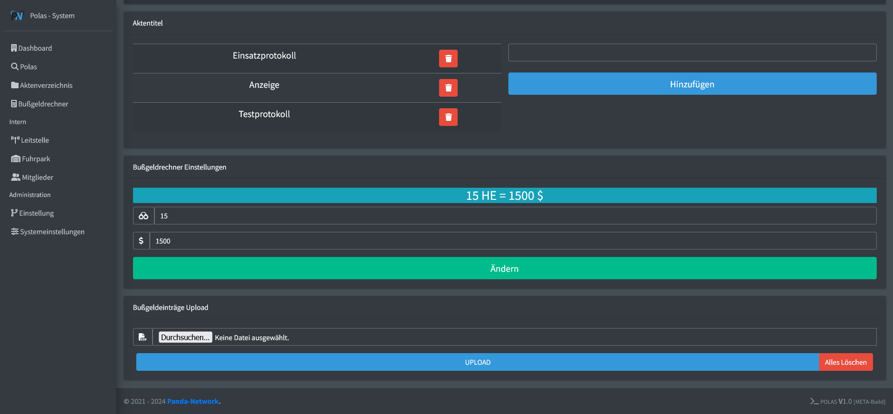

# Bußgeldrechner

## Datei

**Datei herunterladen**
   Download-Link: [https://pnnet.dev/calc-raw](https://pnnet.dev/calc-raw)
   Diese Datei kann in jedem Tabellenprogramm, das `.csv`-Dateien unterstützt, geöffnet werden.

## Artikel hinzufügen & bearbeiten

1. **Datei herunterladen und öffnen**
   Laden Sie die Datei über den obigen Link herunter und öffnen Sie sie in einem Tabellenprogramm.

   

2. **Paragraphen eintragen**
   Ab Zeile `2` können Sie Ihre Paragraphen für den Rechner eintragen – ohne `§` und ohne Einheiten. Die Einheiten werden automatisch per Script an den richtigen Stellen hinzugefügt.

3. **Datei speichern**
   Wenn alle Artikel und Bußgelder korrekt eingestellt sind, wie z. B. die Hafteinheiten, speichern Sie die Datei ab.

4. **Ins Polas-System gehen**
   Gehen Sie ins Polas-System und navigieren Sie zur Seite `Einstellung`. (Beachten Sie, dass dafür bestimmte Benutzerrechte erforderlich sind: `Ränge/Rechte Bearbeiten`.)

   

5. **Datei hochladen**
   Unter `Bußgeldeinträge Upload` laden Sie die zuvor gespeicherte Datei hoch. Alle Daten aus der `.csv`-Datei werden nun eingefügt.

**Wichtig:** Die Einträge werden genau so gespeichert, wie sie in der Datei stehen. Die erste Zeile wird dabei nicht übernommen.
