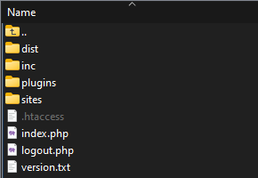

# Quick Start Guide

## Anforderungen

Um die Software erfolgreich zu installieren, benötigen Sie:

- Einen funktionierenden Webspace mit Apache Server
- PHP Version 7.4 oder höher
- Eine MySQL/MariaDB-Datenbank

## Installation

1. **Dateien hochladen**
   Entzippen Sie die bereitgestellten Dateien und laden Sie diese anschließend auf Ihren Webspace hoch.

   

2. **Datenbank einrichten**
   Erstellen Sie eine neue Datenbank. Importieren Sie anschließend die Datei `DATABASE/pn_polassystem.sql` in diese Datenbank.

3. **Konfiguration anpassen**
   Benennen Sie die Datei `inc/config_example.php` in `inc/config.php` um,
   öffnen Sie die Datei `inc/config.php` und passen Sie in den Zeilen `16` bis `18` die Datenbankverbindung an:

   ```php
   //!! ANPASSEN !!
   $dsn = 'mysql:host=DBDOMAIN; dbname=DBNAME';
   $user = 'DBUSER';
   $password = 'DBPASSWORD';
   ```

4. **Zugriff auf die Webseite**
   Sobald die Konfiguration abgeschlossen ist, können Sie die Webseite aufrufen. Verwenden Sie die folgenden Anmeldedaten, um sich einzuloggen:

   ```
   Benutzername: admin
   Passwort: admin
   ```

   **Wichtiger Hinweis:** Bitte ändern Sie das Passwort umgehend, da dies die Standardanmeldedaten für alle neuen Installationen sind und vollständigen Zugriff gewähren.
